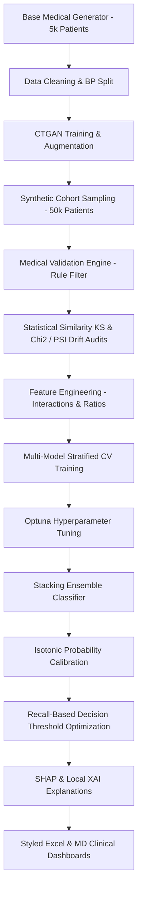

# Enterprise Synthetic Medical AI & Cancer Predictor Platform

An enterprise-grade, end-to-end Machine Learning pipeline that simulates a joint-distribution cohort of lung cancer patients, trains a **CTGAN Tabular Generative Adversarial Network** to scale it to 50,000+ patients, clinical-audits and statistical-validates the synthetic data, tunes boosting models with **Optuna**, builds a **Stacking Ensemble**, and applies **Isotonic Calibration** and **Threshold Optimization** to maximize clinical safety (Sensitivity > 95%).

---

## 1. System Architecture



---

## 2. Directory Structure

```text
synthetic_medical_ai/
│
├── config/
│   └── settings.json                  # Project-wide constants and hyperparams
│
├── preprocessing/
│   ├── data_cleaner.py                # Joint-cohort simulation & parsing
│   ├── feature_engineering.py          # Derived variables and feature selection
│   └── preprocessing_pipeline.py      # Standard scaling and leakage-safe steps
│
├── augmentation/
│   ├── ctgan_trainer.py               # CUDA-accelerated PyTorch CTGAN Trainer
│   ├── synthetic_generator.py         # Massive cohort sampling module
│   ├── conditional_sampling.py        # Rejection sampling subgroups
│   └── gan_monitor.py                 # GAN loss convergence plots
│
├── validation/
│   ├── medical_validator.py           # Medical clinical rule validator
│   ├── statistical_validator.py       # KS & Chi2 similarity checking
│   ├── drift_detector.py              # Population Stability Index (PSI)
│   └── quality_scoring.py             # Global tabular quality metric
│
├── training/
│   ├── train_models.py                # CV multi-model trainer
│   ├── hyperparameter_tuning.py       # Optuna Bayesian parameter tuning
│   ├── ensemble_pipeline.py           # Stacking & Voting classifiers
│   ├── threshold_optimizer.py         # 95%+ Recall grid search optimizer
│   └── calibration_pipeline.py        # Isotonic & Platt scaling
│
├── explainability/
│   ├── shap_analysis.py               # SHAP global and local attribution
│   ├── feature_importance.py          # Relative rank model importances
│   └── prediction_explainer.py        # Patient risk card summary formatter
│
├── data/                              # Data warehouse (auto-generated)
│   ├── raw/
│   ├── processed/
│   ├── synthetic/
│   ├── validated/
│   └── reports/                       # Styled Excel, Markdown, and PNG charts
│
├── models/                            # Joblib serializations (auto-generated)
│
├── requirements.txt                   # Dependency list
├── pipeline_runner.py                 # Central pipeline Orchestrator
└── README.md                          # Platform documentation
```

---

## 3. Core Capabilities

1. **Medical & Statistical Validation Engine:**
   Checks 100% of patient records against anatomical and physiological constraints (e.g., zeroing smoker metrics for Never-smokers, enforcing `Years_Smoked <= Age - 10`, clipping `Oxygen_Saturation` $\in [50.0, 100.0]$). Computes KS-statistics and Chi-Square contingency matrices to compare real vs. synthetic data.
2. **Clinical Stacking Ensemble & Calibration:**
   Stacks XGBoost, CatBoost, Random Forest, and Gradient Boosting with a Logistic Regression meta-learner. Calibrates probabilities via **Isotonic Regression** for accurate absolute risk estimation.
3. **Threshold Safety Optimization:**
   Searches decision cutoffs to guarantee Recall (Sensitivity) $\ge 95\%$, preventing costly missed cases in cancer diagnostics.
4. **Explainable AI (XAI):**
   Applies SHAP TreeExplainer for global attributions and patient-specific risk factor breakdown.

---

## 4. How to Run

### Local Execution

1. Install dependencies:
   ```bash
   pip install -r requirements.txt
   ```

2. Run the entire pipeline in high-speed test mode (1,000 base, 2,000 synthetic records, 2 epochs) to verify setup:
   ```bash
   python synthetic_medical_ai/pipeline_runner.py --test-mode
   ```

3. Run the full enterprise production pipeline (5,000 base, 50,000 synthetic records, 15 epochs):
   ```bash
   python synthetic_medical_ai/pipeline_runner.py
   ```

---

## 5. Generated Clinical Dashboards
All reports are outputted to the `synthetic_medical_ai/data/reports/` folder:
- **`ModelMetrics.xlsx`**: An executive, colored, beautifully formatted workbook containing model performance matrixes, covariate metrics, and feature importance ranks.
- **`Final_Evaluation_Report.md`**: Executive markdown summary of the platform's diagnostic capability.
- **`plots/`**: Diagnostic curves including GAN convergence, reliability curves, confusion matrices, and ROC/Precision-Recall curves.
